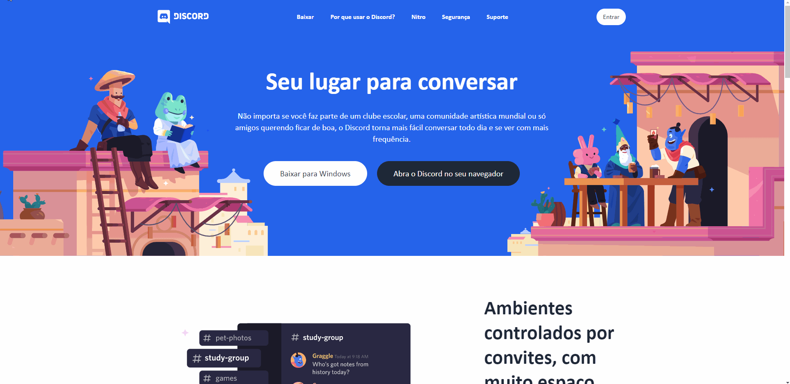

# UI Clone - Discord Web

## Sobre

O objetivo deste projeto é aprender e fixar os conceitos das tecnologias **Next.js**, **Tailwind CSS** e um pouco do **Framer Motion**.



## Tecnologias

Tecnologias utilizadas no desenvolvimento deste projeto.

- [ReactJS](https://pt-br.reactjs.org/)
- [Next.js](https://nextjs.org/)
- [TypeScript](https://www.typescriptlang.org/)
- [Tailwind CSS](https://tailwindcss.com/)
- [Framer Motion](https://www.framer.com/motion/)
- [ESLint](https://eslint.org/)
- [Prettier](https://prettier.io/)
- [EditorConfig](https://editorconfig.org/)
- [Husky](https://www.npmjs.com/package/husky)
- [Commitlint](https://github.com/conventional-changelog/commitlint)

## Como rodar

**Faça um clone deste repositório e acesse a pasta do projeto**

```bash
$ git clone https://github.com/brfeitoza/discord-clone-nextjs-tailwindcss.git && cd discord-clone-nextjs-tailwindcss
```

**Siga os passos a seguir**

```bash
# Instalar todas as dependências
$ yarn

# Execute o comando abaixo para rodar o projeto
$ yarn dev

# Pronto! O projeto está rodando no endereço: http://localhost:3000.
```

## Licença

Este projeto está licenciado sob a Licença **MIT** - consulte o arquivo [LICENSE](LICENSE) para obter detalhes.

---

🚀 Feito por **Bruno Fernando Feitoza** &nbsp; | &nbsp;[Meu LinkedIn](https://www.linkedin.com/in/brunofeitoza634/)
