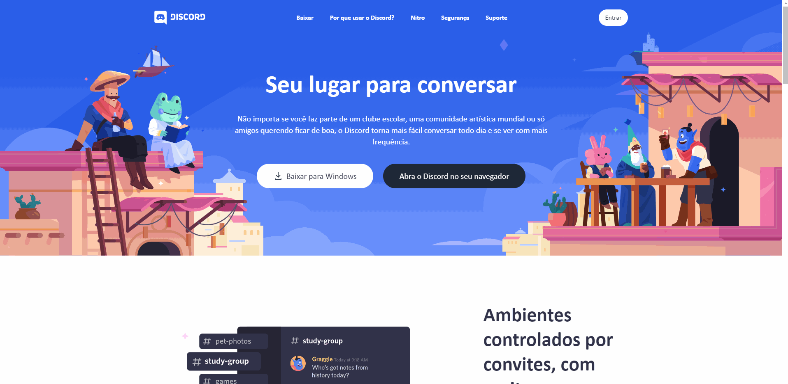

# UI Clone - Discord Web

## ⁉ Sobre

O objetivo deste projeto é aprender e fixar os conceitos das tecnologias **Next.js**, **Tailwind CSS** e um pouco do **Framer Motion**.



## 🛠 Tecnologias

Tecnologias utilizadas no desenvolvimento deste projeto.

- [ReactJS](https://pt-br.reactjs.org/)
- [Next.js](https://nextjs.org/)
- [TypeScript](https://www.typescriptlang.org/)
- [Tailwind CSS](https://tailwindcss.com/docs/font-weight)
- [Framer Motion](https://www.framer.com/motion/)
## 💻 Como rodar

**Faça um clone deste repositório e acesse a pasta do projeto**

```bash
$ git clone https://github.com/brfeitoza/discord-clone-nextjs-tailwindcss.git && cd discord-clone-nextjs-tailwindcss
```

**Siga os passos a seguir**

```bash
# Instalar todas as dependências
$ yarn

# Execute o comando abaixo para rodar o projeto
$ yarn dev

# Pronto! O projeto está rodando no endereço: http://localhost:3000.
```

## 📝 Licença

Este projeto está licenciado sob a Licença **MIT** - consulte o arquivo [LICENSE](LICENSE) para obter detalhes.

---

🚀 Feito por **Bruno Fernando Feitoza**   |  [Meu LinkedIn](https://www.linkedin.com/in/brunofeitoza634/)
